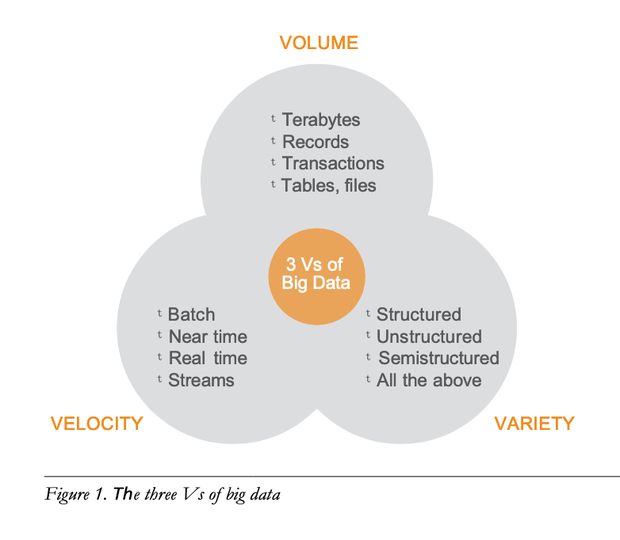
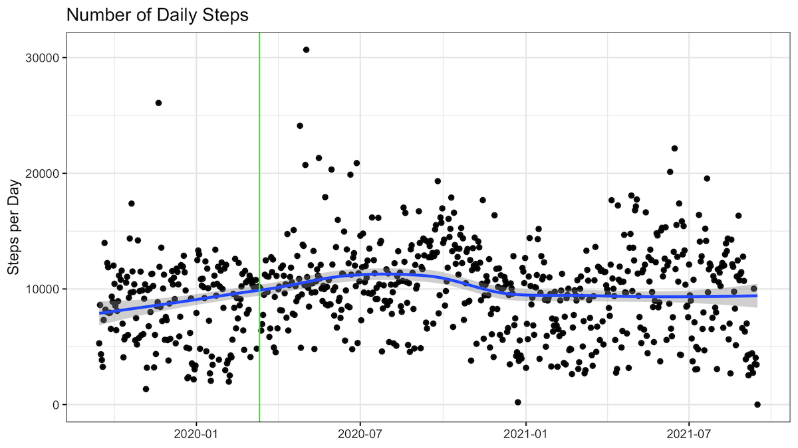
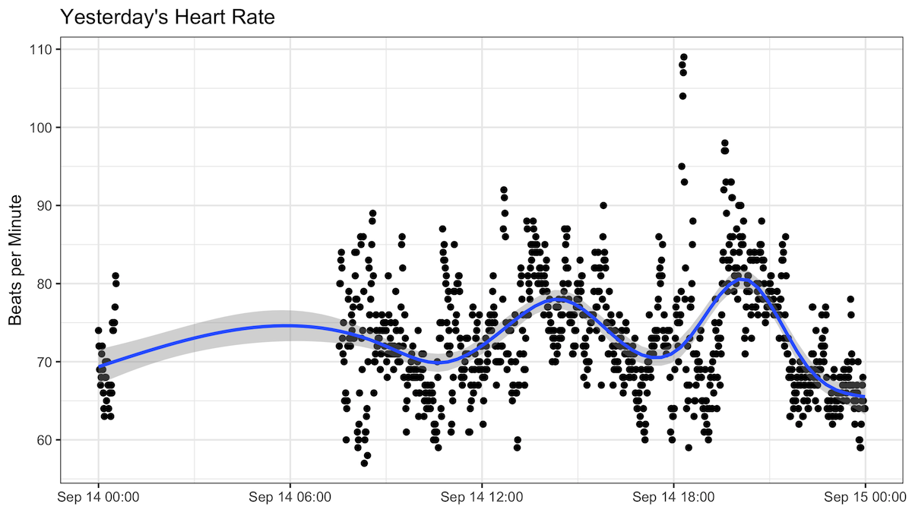
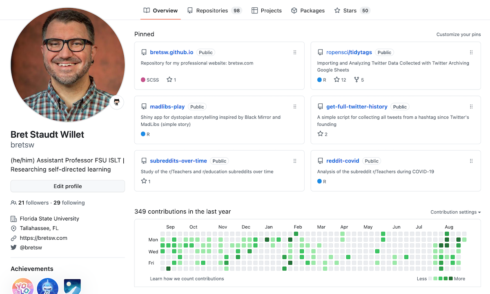
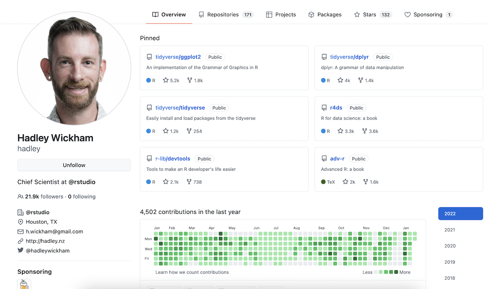
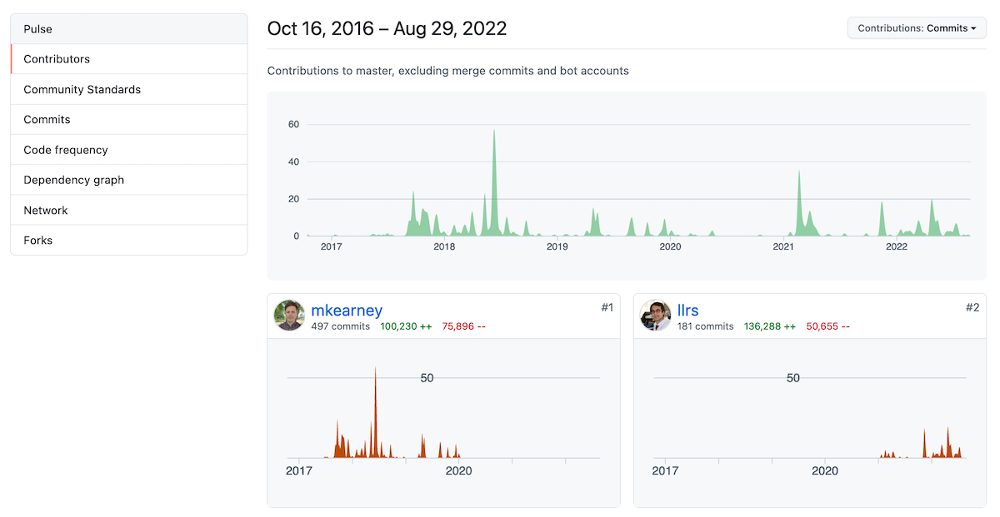
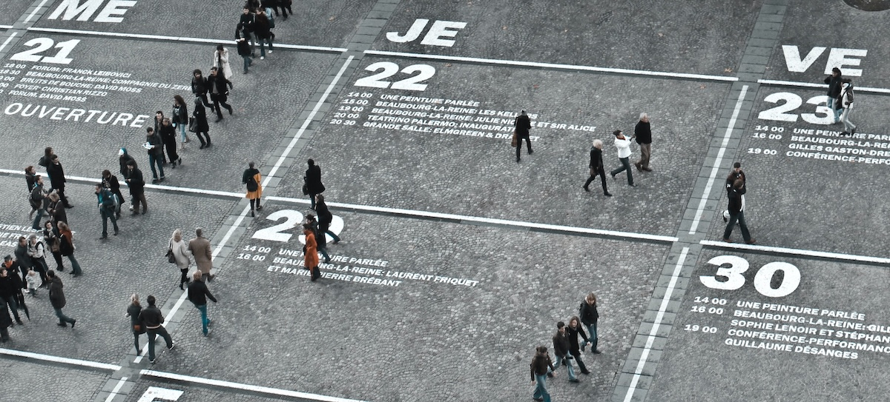

```{r setup, include=FALSE}
usethis::use_git_ignore(c("*.csv", "*.rds"))
options(htmltools.dir.version = FALSE)

library(knitr)
library(tidyverse)
library(xaringan)
library(fontawesome)
```

class: inverse, center, middle

# `r fa("far fa-images", fill = "#fff")`

**View the slides:** 

[bretsw.com/eme6356-su26-module2](https://bretsw.com/eme6356-su26-module2)

---

class: inverse, center, middle

# `r fa("thumbs-up", fill = "#fff")` <br><br> Looking Back at Module 1

---

# `r fa("thumbs-up", fill = "#fff")` Defining "big data"

```{r, out.width = "540px", echo = FALSE, fig.align = "center"}

```

### The three Vs of big data (Russom, 2011, p. 6)

---

# `r fa("thumbs-up", fill = "#fff")` Optimism about Analytics

```{r, out.width = "480px", echo = FALSE, fig.align = "center"}

```

--

**Opportunities:**

--

- Treat patients

--

- Monitor parking

--

- Prepare stock in preparation of hurricanes

---

# `r fa("thumbs-down", fill = "#fff")` Pessimism about Analytics

```{r, out.width = "480px", echo = FALSE, fig.align = "center"}

```

**Challenges:**

--

- Surveillance concerns and misuse of data

--

- Analytics reports can be lengthy and difficulty to understand

--

- Lack of infrastructure for implementation of analytics in many contexts

---

class: inverse, center, middle

# `r fa("fas fa-question", fill = "#fff")` <br><br> Module 1 <br> Final Thoughts?


---

class: inverse, center, middle

# `r fa("fas fa-chart-line", fill = "#fff")` <br><br> Module 2: <br> Performance Analytics

---

class: inverse, center, middle

# `r fa("fas fa-chart-line", fill = "#fff")` <br> <br> **Defining Analytics**

---

class: inverse, left, middle

# `r fa("fas fa-chart-line", fill = "#fff")` Analytics:

###

---

class: inverse, left, middle

# `r fa("fas fa-chart-line", fill = "#fff")` Analytics:

### Measure

---

class: inverse, left, middle

# `r fa("fas fa-chart-line", fill = "#fff")` Analytics:

### Measure `r fa("fas fa-arrow-right", fill = "#fff")` Collect

---

class: inverse, left, middle

# `r fa("fas fa-chart-line", fill = "#fff")` Analytics:

### Measure `r fa("fas fa-arrow-right", fill = "#fff")` Collect `r fa("fas fa-arrow-right", fill = "#fff")` Analyze

---

class: inverse, left, middle

# `r fa("fas fa-chart-line", fill = "#fff")` Analytics:

### Measure `r fa("fas fa-arrow-right", fill = "#fff")` Collect `r fa("fas fa-arrow-right", fill = "#fff")` Analyze `r fa("fas fa-arrow-right", fill = "#fff")` Report

---

class: inverse, center, middle

# `r fa("fas fa-chart-line", fill = "#fff")` <br> <br> **Performance at Home**

---

# Performance at Home

```{r, out.width = "480px", echo = FALSE, fig.align = "center"}

```

Measure `r fa("fas fa-arrow-right", fill = "#782F40")` Collect `r fa("fas fa-arrow-right", fill = "#782F40")` Analyze `r fa("fas fa-arrow-right", fill = "#782F40")` Report

--

**What might we measure?**

---

# Performance at Home

```{r, out.width = "480px", echo = FALSE, fig.align = "center"}

```

- How does your electricity usage at home relate to changes in work-from-home days?

--

- How have your sleep patterns changed since having a baby?

--

- How has your heart rate changed since starting a new exercise routine?

---

# Performance Analytics Example

### Fitbit

```{r, out.width = "600px", echo = FALSE, fig.align = "center"}

```

--

**What might we measure?**

---

# Performance Analytics Example

### Fitbit: Daily Steps During COVID-19

```{r, out.width = "720px", echo = FALSE, fig.align = "center"}

```

View the code [on GitHub](https://github.com/bretsw/fitbit)

---

# Performance Analytics Example

### Fitbit: Heart Rate Yesterday

```{r, out.width = "720px", echo = FALSE, fig.align = "center"}

```

View the code [on GitHub](https://github.com/bretsw/fitbit)


---

class: inverse, center, middle

# `r fa("fas fa-chart-line", fill = "#fff")` <br> <br> **Performance at Work**

---

# Performance at Work

```{r, out.width = "600px", echo = FALSE, fig.align = "center"}

```

Measure `r fa("fas fa-arrow-right", fill = "#782F40")` Collect `r fa("fas fa-arrow-right", fill = "#782F40")` Analyze `r fa("fas fa-arrow-right", fill = "#782F40")` Report

**What might we measure?**

---

# Performance at Work

```{r, out.width = "600px", echo = FALSE, fig.align = "center"}

```

- How does productivity when working from home compare to when working at the office?

--

- Who do you tend to go to for professional advice?

--

- How has the sentiment of team messages changed in the past year?

---

# Performance Analytics Example

### GitHub User Profile: @bretsw

```{r, out.width = "720px", echo = FALSE, fig.align = "center"}

```

[View the webpage](https://github.com/bretsw)

---

# Performance Analytics Example

### GitHub User Profile: @hadley

```{r, out.width = "720px", echo = FALSE, fig.align = "center"}

```

[View the webpage](https://github.com/hadley)

---

# Performance Analytics Example

### GitHub: {rtweet} R Package Contributors

```{r, out.width = "100%", echo = FALSE, fig.align = "center"}

```

[View the webpage](https://github.com/ropensci/rtweet/graphs/contributors)


---

class: inverse, center, middle

# `r fa("fas fa-binoculars", fill = "#fff")` <br><br> Looking ahead

---

# `r fa("fas fa-calendar-day", fill = "#fff")` Semester schedule

```{r, out.width = "200px", echo = FALSE, fig.align = "center"}

```

- **Module 1:** Intro to Analytics

<hr>

- **Module 2: Performance Analytics** `r fa("fas fa-arrow-left", fill = "#782F40")`

- **Module 3:** Learning Analytics

- **Module 4:** Web Analytics

<hr>

- **Module 5:** Data Visualization

<hr>

- **Module 6:** Ethics in Learning Analytics

- **Module 7:** Future of Analytics

- **Module 8:** Case Discussions

---

# `r fa("fas fa-calendar-day", fill = "#fff")` Module structure

```{r, out.width = "480px", echo = FALSE, fig.align = "center"}

```

- `r fa("fas fa-video", fill = "#782F40")` Watch

- `r fa("fas fa-compass", fill = "#782F40")` Explore

- `r fa("fas fa-book-open", fill = "#782F40")` Read

- `r fa("fas fa-comments", fill = "#782F40")` Discuss

- `r fa("fas fa-keyboard", fill = "#782F40")` Create

---

# `r fa("fas fa-calendar-day", fill = "#fff")` Upcoming Assignments

```{r, out.width = "600px", echo = FALSE, fig.align = "center"}

```

--

### Discussion (50 points)

--

- Initial post on Canvas due by second Friday (but post as early as possible)

--

- At least 3 responses due on Canvas by end of Module 2 (second Sunday)

---

# `r fa("fas fa-calendar-day", fill = "#fff")` Upcoming Assignments

```{r, out.width = "360px", echo = FALSE, fig.align = "center"}

```

### Analytics Problem Plan (100 points) - **due end of Module 3**

--

- "Write a brief report (approximately 750-1000 words) identifying and describing a real-world problem that might be addressed via analytics."

--

- "The emphasis of this assignment is on the conceptualization of the problem and the clear identification of a possible data source."

--

- "Then briefly describe how analytics will be used to solve the problem" 

--

- "You will not need to collect actual data related to this problem, just plan for how it would be done."

---

# `r fa("fas fa-calendar-day", fill = "#fff")` Upcoming Assignments

```{r, out.width = "600px", echo = FALSE, fig.align = "center"}

```

### Project Team Formation

--

- Coordinate on Canvas: Match by topical interest (similar) and skillset (complementary)

--

- **Form teams this week!**


---

class: inverse, center, middle

# `r fa("fas fa-question", fill = "#fff")` <br><br> Questions

<hr>

**What questions can I answer for you now?**

**How can I support you this week?**

<hr>

`r fa("envelope", fill = "#fff")` [bret.staudtwillet@fsu.edu](mailto:bret.staudtwillet@fsu.edu) | `r fa("globe", fill = "#fff")` [bretsw.com](https://bretsw.com) | `r fa("fab fa-github", fill = "#fff")` [GitHub](https://github.com/bretsw/)

---

class: inverse, center, middle

# `r fa("fas fa-otter", fill = "#fff")` <br><br> Play in the <br> [Analytics Sandbox](https://bretsw.com/sandbox)

`r fa("fab fa-github", fill = "#fff")` [GitHub repository for code and data](https://github.com/bretsw/sandbox)

`r fa("fas fa-cubes-stacked", fill = "#fff")` [Datasets for practice](https://bretsw.com/post/datasets/)
